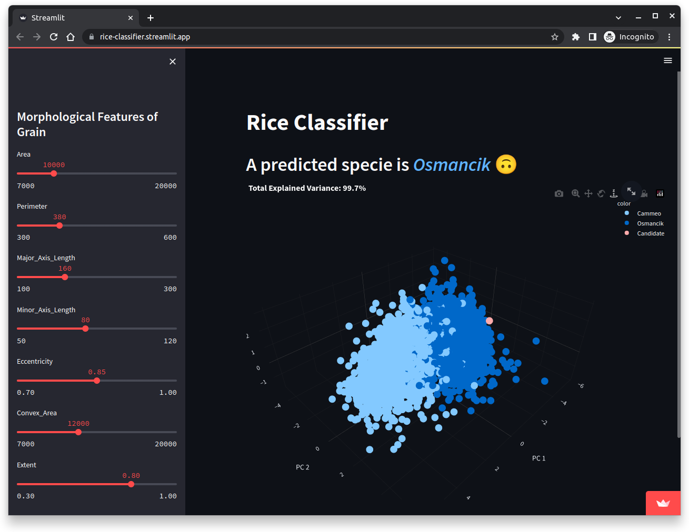

# Rice Classifier

Interactive AI classifier of rice grain.

## Demo

Deployed on Streamlit Community Cloud:
https://rice-classifier.streamlit.app 

## ML Workflow

# Metrics
								
| Method | Accuracy | Precision | Recall | F1 | AUC |
| :----: | :----: | :----: | :----: | :----: | :----: |
| logreg_sag |0.911	|0.875	|0.923	|0.899	|0.975|
| logreg_lbfgs |0.912	|0.878	|0.923	|0.900	|0.975|
| **svm_linear** |**0.923**	|0.899	|**0.923**	|**0.911**	|**0.976**|
| svm_poly |0.908	|0.898	|0.887	|0.892	|0.968|
| nn       |0.921	|**0.910**	|0.905	|0.908	|0.976|

